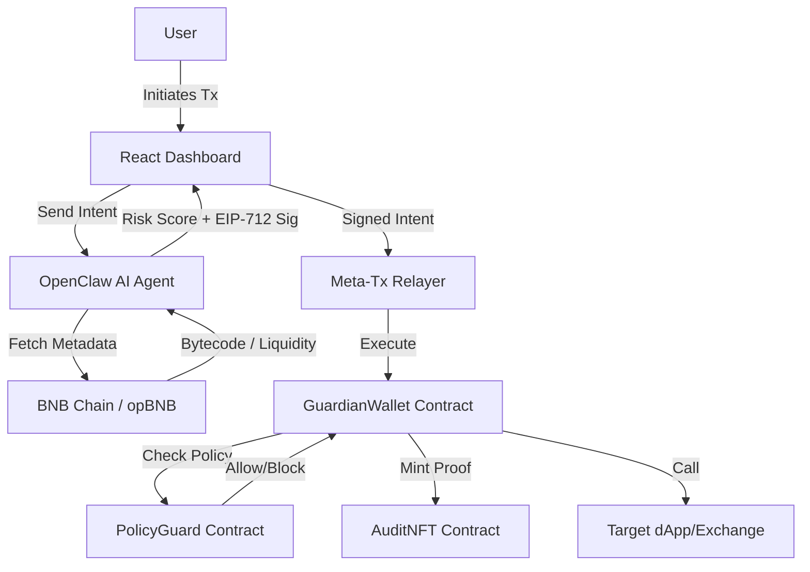

# GuardianClaw

### AI-Powered Non-Custodial Transaction Firewall for BNB Chain

GuardianClaw is a next-generation security protocol designed to protect DeFi users from honeypots, rug pulls, and malicious signature drains. By combining real-time AI agents with on-chain policy enforcement, GuardianClaw acts as an autonomous bodyguard for your wallet, blocking threats before funds ever leave your control.

---

## Technical Stack


---

## Detailed Project Description

### The Problem: The DeFi Wild West
In the current BNB Chain ecosystem, speed and low fees have led to a massive influx of retail users. However, this has also made it a prime target for malicious actors. Users frequently fall victim to:
1. **Honeypot Tokens**: Contracts that allow you to buy but prevent you from selling.
2. **Rug Pulls**: Developers draining liquidity from a pool suddenly.
3. **Approval Scams**: Malicious dApps requesting unlimited approvals to drain wallets.
4. **Phishing Signatures**: Social engineering users into signing EIP-712 messages that compromise their assets.

In most cases, security tools are passive—they warn you after a scan or after a transaction has already been processed.

### The Solution: GuardianClaw's Autonomous Firewall
GuardianClaw shifts the paradigm from "Passive Detection" to "Active Enforcement." Our system consists of three core layers that work in perfect synchrony:

#### 1. The OpenClaw AI Risk Engine (Off-Chain)
Our AI agent constantly monitors proposed transaction intents. When a user prepares to interact with a contract, the agent performs:
- **Bytecode Analysis**: Scans for known malicious patterns (e.g., hidden mint functions or blocked transfers).
- **Liquidity Verification**: Checks the depth and lock status of the token's liquidity pool.
- **Ownership Risk Assessment**: Analyzes the creator wallet and contract owner for suspicious history.
- **Simulation**: Runs a "dry-run" of the transaction in a sandboxed environment to see if it results in a "blocked sell" or other trap.

#### #### 2. The PolicyGuard Smart Contract (On-Chain)
This acts as the "Mandate" for your wallet. It enforces user-defined rules that cannot be bypassed, even if the user accidentally signs a malicious transaction:
- **Daily Spending Limits**: Prevents the total drainage of a wallet in a single day.
- **Real-Time Blocklist**: Automatically syncs with the AI agent's findings to block known malicious addresses globally.
- **Emergency Pause**: A kill-switch that can be activated by the user or the agent if suspicious activity spikes.

#### 3. The AuditNFT Protocol (Proof of Protection)
Transparency is key to trust. Every time our AI agent intervenes—whether it blocks a honeymoon or confirms a safe swap—it mints a non-fungible token (AuditNFT) on opBNB. This NFT contains a cryptographic link to the agent's decision logs and the associated transaction hash, providing users with an immutable record of their protection history.

---

## Architecture Diagram



---

## Key Features

- **Autonomous Agentic Security**: Real-time scanning using the OpenClaw framework.
- **On-Chain Policy Guard**: Smart contract-based enforcement that lives on the blockchain.
- **Non-Custodial Design**: Users retain full control of their keys; agents act via ephemeral session keys.
- **Immutable Audit Trail**: On-chain verification of every security action.
- **EIP-712 Intent Flow**: Secure, gas-optimized meta-transactions.

---

## Project Structure

```text
/guardian-claw
├── /contracts        # Solidity Smart Contracts (Wallet, PolicyGuard, AuditNFT)
├── /agent            # AI Agent Risk Engine (Modular Detectors)
├── /relayer          # Meta-transaction submission service
├── /frontend         # React + Vite Dashboard & Transaction UI
├── /scripts          # Deployment and Demo automation scripts
└── /test             # Comprehensive Hardhat & Integration tests
```

---

## Getting Started

### Installation
1. Clone the repository:
   ```bash
   git clone https://github.com/0xsupremedev/guardian-claw.git
   ```
2. Install dependencies:
   ```bash
   npm install
   ```

### Deployment
Deploy to opBNB Testnet:
```bash
npx hardhat run scripts/deploy.js --network opbnbTestnet
```

---

## Security Disclaimer
This software is a Proof of Concept (PoC) built for the BNB Chain AIDP Hackathon. It is experimental and has not undergone a professional security audit. Use at your own risk.

## License
MIT License - Copyright (c) 2024 GuardianClaw Team
